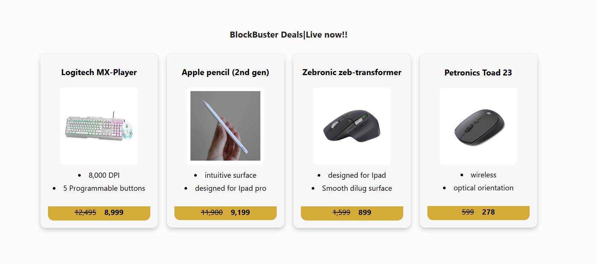

A simple React project that replicates an Amazon-style product card. The card displays a product image, title, price, and an “Add to Cart” button. Designed to practice React components, props, and basic styling for modern UI layouts.

1) The project was built to practice core React concepts such as:

2) Functional components and JSX

3) Passing and handling props

4) Basic state management (optional, e.g. for button clicks)

5) CSS styling for layout and hover effects

 Author - Parth Sakpal.
